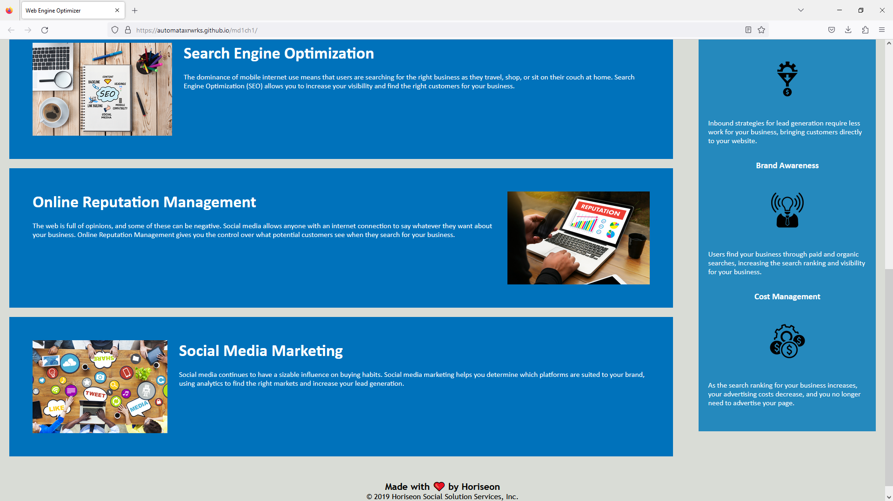

# 📖 Code Refactor for Challenge 1

The web page for challenge 1 is given as the next image.

In this project is contained the web development refactoring code for challenge 1 of module 1. Requested aspects for the challenge where made on the code such as:

* Selection of a well concise and descriptive title

* Descriptive text on alt attributes

* Css with semantic structure

# 🏆 The base code is deployed a this link 

https://automataxrwrks.github.io/md1ch1/

##Go to Website: [md1ch1](https://automataxrwrks.github.io/md1ch1/)

